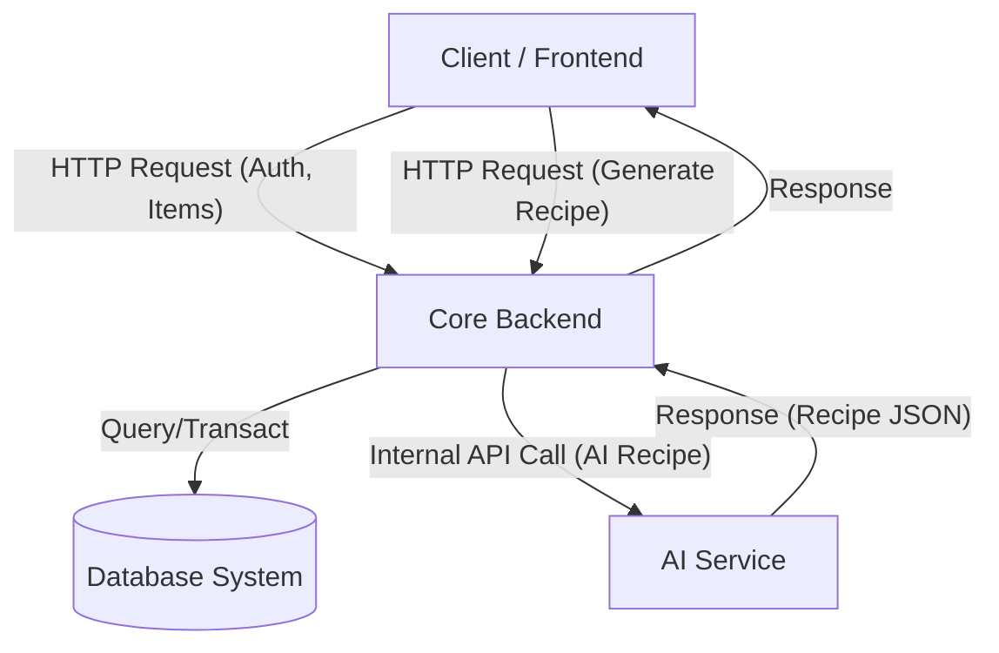
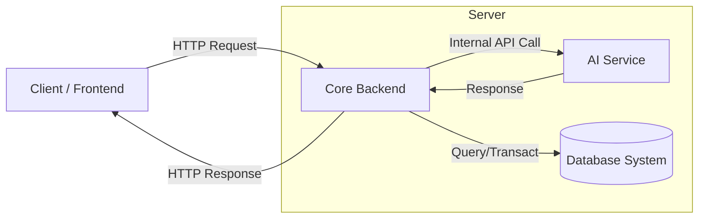
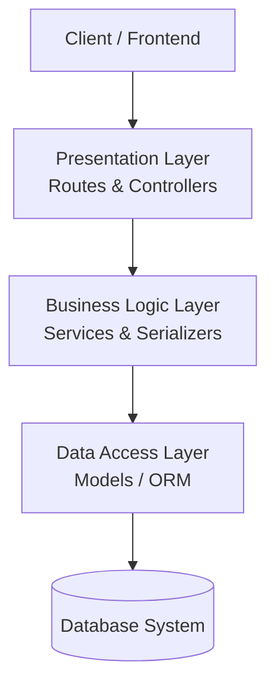
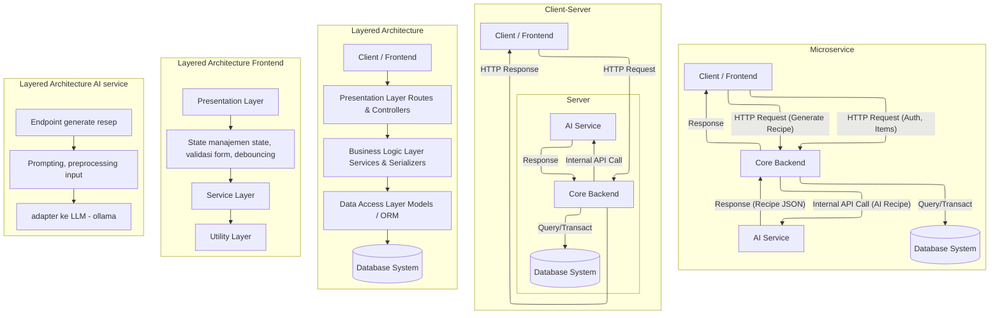

# Architectural Styles - Community Kitchen

Dokumen ini menjelaskan gaya arsitektur yang diterapkan dalam pengembangan sistem Community Kitchen.

## 1. Pembagian Subsistem (Subsystems)

Sistem dibagi menjadi tiga subsistem utama yang saling berinteraksi:

1.  **Subsistem Client (Frontend)**
    *   Bertanggung jawab atas antarmuka pengguna (UI) dan pengalaman pengguna (UX).
    *   Teknologi: Vue.js / Mobile WebView.
2.  **Subsistem Core Server (Backend Utama)**
    *   Menangani logika bisnis utama: Autentikasi, Manajemen Barang, Peminjaman/Request.
    *   Teknologi: Laravel/Django.
3.  **Subsistem AI Service (Intelligence)**
    *   Layanan khusus untuk pemrosesan kecerdasan buatan (Generate Resep).
    *   Teknologi: FastAPI + Ollama.

### Diagram Interaksi Antar Subsistem

---

## 2. Gaya Arsitektural (Architectural Styles)

### A. Client-Server Architecture
Sistem memisahkan tanggung jawab antara penyedia sumber daya (Server) dan peminta layanan (Client).

*   **Penerapan:**
    *   **Client:** Aplikasi Frontend (Mobile/Web) tidak menyimpan logika bisnis yang berat, hanya bertugas menampilkan data dan mengirim input pengguna.
    *   **Server:** Backend menyediakan API (RESTful) yang merespon request dari Client dengan format JSON, termasuk sebagai gateway untuk fitur AI.
*   **Alasan:** Memungkinkan pengembangan frontend dan backend dilakukan secara independen. Backend yang sama dapat melayani platform berbeda (Web, Android, iOS).

**Visualisasi Client-Server**

### B. Microservices (Service-Oriented) Architecture
Fungsionalitas sistem dipecah menjadi layanan-layanan kecil yang independen dan berjalan sebagai proses terpisah.

*   **Penerapan:**
    *   **Core Service:** Fokus pada manajemen user, transaksi barang, dan notifikasi.
    *   **AI Service:** Fokus pada komputasi berat (LLM Inference) untuk resep, diakses melalui backend utama.
*   **Alasan:**
    *   **Skalabilitas:** Server AI yang butuh resource besar (GPU/RAM) bisa di-scale terpisah dari server utama.
    *   **Isolasi Kegagalan:** Jika layanan AI sedang down (maintenance/error), fitur utama (login, pinjam barang) tidak terganggu.
    *   **Fleksibilitas Teknologi:** Menggunakan Python untuk AI (karena ekosistem AI kuat) dan kerangka kerja web yang matang untuk fitur sosial.

### C. Layered Architecture
Di dalam internal setiap subsistem backend, kode diorganisir ke dalam lapisan-lapisan logis (Layers) dengan tanggung jawab spesifik.

**Catatan:** Jumlah dan nama layer tidak harus sama di setiap subsistem. Prinsip utamanya adalah pemisahan tanggung jawab; layer bisa berbeda sesuai kebutuhan masing-masing komponen.

*   **Penerapan (Contoh pada Core Backend):**
    Visualisasi menunjukkan 5 komponen dalam alur data, di mana **3 di tengah** adalah layer aplikasi backend:
    1.  **Client / Frontend (External):** Mengirim request ke server.
    2.  **Presentation Layer (Routes & Controllers):** Menerima HTTP request, validasi input, dan memanggil business logic.
    3.  **Business Logic Layer (Services/Serializers):** Menjalankan aturan bisnis (misal: cek stok, hitung denda).
    4.  **Data Access Layer (Models/ORM):** Berinteraksi/query ke database.
    5.  **Database System (Infrastructure):** Sistem penyimpanan data fisik.
*   **Alasan:** Memudahkan maintenance dan testing (Testability). Jika kita ingin mengubah database, kita hanya perlu mengubah Data Layer tanpa mengganggu Presentation Layer.

**Visualisasi Layered Architecture (Core Backend)**

**Penerapan Layered Architecture Lainnya**

- **Frontend (Client):**
    - Presentation/UI Layer: komponen tampilan, halaman, layout.
    - State/Interaction Layer: manajemen state, validasi form, debouncing.
    - Service/API Layer: wrapper HTTP untuk komunikasi ke backend.
    - Utility Layer: helper, formatter, konfigurasi.
- **AI Service (FastAPI):**
    - API Layer: endpoint generate resep.
    - Service/Use-Case Layer: orkestrasi prompt, preprocessing input, postprocessing output.
    - Integration Layer: adapter ke Ollama/LLM.
    - Data/Cache Layer (opsional): cache hasil resep.
- **Database/Storage:**
    - Schema/Model Layer: struktur tabel dan relasi.
    - Repository/Query Layer: query/ORM yang dipakai backend.
- **Testing:**
    - Unit Test Layer: menguji fungsi tiap layer.
    - Integration Test Layer: menguji alur antar layer (API → service → DB).

