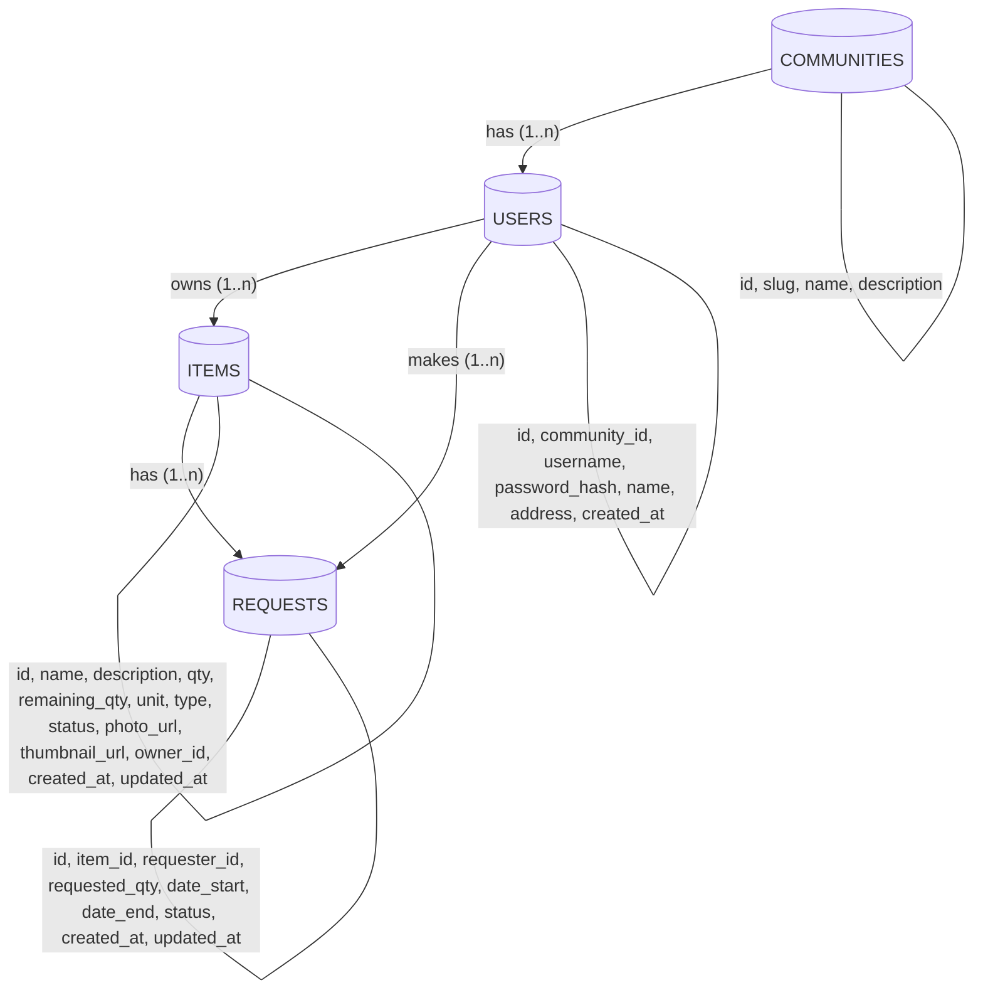

# Specification

## latest version: 14 nov 2025 

# Halaman aplikasi:

1. Login
2. Register
3. Homepage -> feed item komunitas (bisa request di sini)
4. Resep
5. MyPage -> item saya + request saya (incoming/outgoing)

---

## 1. Login

**Alur:** User memasukkan username & password -> klik login -> dapat token -> redirect ke Homepage. Jika sudah login (ada token valid), auto redirect ke Homepage.

**Elements:**

- Input username
- Input password
- Button login
- Div error message

**API Called:** `POST /auth/login`

---

## 2. Register

**Alur:** User isi data minimal -> klik daftar -> auto login -> redirect ke Homepage

**Data yang dibutuhkan:**

- Username (unique)
- Password
- Nama lengkap
- Alamat (text bebas)
- Komunitas

**Elements:**

- Input username
- Input password
- Input nama lengkap
- Textarea alamat
- Select Komunitas
- Button daftar
- Div error message

**API Called:** `POST /auth/register`

---

## 3. Homepage (Feed Komunitas)

**Alur:** User lihat daftar item yang dibagikan/dipinjamkan warga **dalam satu komunitas** -> klik item untuk detail -> request jika perlu

**Elements:**

- Header navigation:
  - Link ke homepage
  - Link ke resep
  - Link ke mypage (dengan icon notifikasi)
  - Button tambah item baru
- Button logout
- Input text cari item (auto-search dengan debouncing)
- Select/radio filter tipe (all/borrow/share)
- List/container untuk item-item
- Untuk setiap item card (collapsed):
  - Thumbnail foto
  - Nama item
  - Nama pemilik
  - Qty tersedia (remaining_qty/qty unit)
  - Button expand accordion
- Untuk setiap item card (expanded):
  - Foto full size
  - Nama item
  - Deskripsi lengkap
  - Qty tersedia (remaining_qty/qty unit)
  - Nama pemilik
  - Alamat pemilik
  - Tipe item (borrow/share)
  - Status item (available/borrowed)
  - Button request item (buka form request)
  - Button collapse accordion
- Button previous page
- Button next page
- Text/display halaman saat ini

**Form Request Item (popup/accordion):**

- Input qty yang diminta (number)
- Input tanggal mulai
- Input tanggal selesai (untuk borrow) / tanggal pengambilan (untuk share)
- Button kirim request
- Button batal

**API Called:** 

- `GET /items?page={page_number}&search={keyword}&type={all|borrow|share}` (list semua data)
- `POST /items/{id}/request` (request item)

---

## 4. Resep

**Alur:** User input bahan yang ada -> klik generate -> AI kasih resep

**Elements:**

- Header navigation:
  - Link ke homepage
  - Link ke resep
  - Link ke mypage (dengan icon notifikasi)
  - Button tambah item baru
- Button logout
- Textarea input bahan-bahan
- Button generate resep
- Container output resep
- Loading indicator

**API Called:** `POST /ai/recipe`

---

## 5. MyPage

**Alur:** User kelola item miliknya & lihat status request (yang dia buat & yang masuk ke itemnya)

**Elements:**

**Header navigation:**

- Link ke homepage
- Link ke resep
- Link ke mypage (dengan icon notifikasi)
- Button tambah item baru
- Button logout

**Section Item Saya:**

- Button post new item (buka form)
- List item milik user
- Untuk setiap item:
  - Nama item
  - Qty tersedia (remaining_qty/qty unit)
  - Tipe (borrow/share)
  - Status (available/borrowed)
  - Button edit (buka form)
  - Button hapus (dengan konfirmasi popup)

**Form Tambah/Edit Item (accordion/popup):**

- Input nama item
- Textarea deskripsi item
- Input qty (number)
- Input unit (text, default "pcs")
- Input/upload foto item
- Select/radio tipe item (borrow/share)
- Select/radio status item (available/borrowed)
- Button simpan
- Button batal/tutup

**Section Request Masuk (incoming):**

- List request ke item saya
- Untuk setiap request:
  - Nama peminjam
  - Nama item
  - Qty yang diminta
  - Tanggal mulai - tanggal selesai/pengambilan
  - Status request (pending/approved/rejected/returned)
  - Button approve (hanya muncul jika status pending)
  - Button reject (hanya muncul jika status pending)
  - Button tandai sudah dikembalikan (hanya muncul jika status approved)

**Section Request Saya (outgoing):**

- List request yang saya buat
- Untuk setiap request:
  - Nama pemilik
  - Nama item
  - Qty yang diminta
  - Tanggal mulai - tanggal selesai/pengambilan
  - Status request (pending/approved/rejected/returned)
  - Button cancel (hanya muncul jika status pending)

**API Called:** 

- `GET /user/items`
- `POST /user/items` (tambah)
- `PUT /user/items/{id}` (edit)
- `DELETE /user/items/{id}` (hapus)
- `GET /user/requests?type=incoming`
- `GET /user/requests?type=outgoing`
- `PATCH /user/requests/{id}` (approve/reject/cancel/returned)


# Model
## Data Flow Diagram


---

# Development APIs only

**Catatan:**
- Endpoints ini **hanya aktif** jika environment variable `ENVIRONMENT=development`
- Di production (ENVIRONMENT=production), return `404 Not Found` atau `403 Forbidden`
- Semua endpoint butuh valid access token
- DELETE user akan cascade delete semua item & request milik user tersebut

### Delete Item

**Request:**
```json
DELETE /dev/delete/item/{id}
Authorization: Bearer {access_token}
```

**Response (sukses):**
```json
200 OK
{
  "message": "Item deleted successfully",
  "item_id": 1
}
```

**Response (not found):**
```json
404 Not Found
{
  "error": "Item not found"
}
```

### Delete User

**Request:**
```json
DELETE /dev/delete/user/{username}
Authorization: Bearer {access_token}
```

**Response (sukses):**
```json
200 OK
{
  "message": "User and all related data deleted successfully",
  "username": "testuser",
  "deleted_items": 5,
  "deleted_requests": 3
}
```

**Response (not found):**
```json
404 Not Found
{
  "error": "User not found"
}
```

### Development APIs **Selesai**
---

# API

## Login & Register

### Login

**Request:**

```json
POST /auth/login
Content-Type: application/json

{
  "username": "jqr123",
  "password": "password123"
}
```

**Response (sukses):**

```json
200 OK
{
  "access_token": "eyJhbGciOiJIUzI1NiIsInR5cCI6IkpXVCJ9...",
  "refresh_token": "eyJhbGciOiJIUzI1NiIsInR5cCI6IkpXVCJ8...",
  "token_type": "Bearer",
  "expires_in": 3600,
  "user": {
    "community_id": 1,
    "id": 1,
    "username": "jqr123",
    "name": "Jqwery Ddo",
    "address": "Depan Poskamling RT2. Jl. Mawar No. 5 RT2"
  }
}
```

**Response (gagal):**

```json
401 Unauthorized
{
  "error": "Invalid username or password"
}
```

### Refresh Token

**Catatan:** Refresh token otomatis dilakukan sebelum setiap request API jika access_token hampir expired, atau saat menerima response 401 Unauthorized.

Logout dilakukan oleh frontend, cukup hapus access token saja.

JWT 

    Access token payload: { user_id, username, exp: 1jam }
    
    Refresh token payload: { user_id, exp: 30hari }

**Request:**

```json
POST /auth/refresh
Content-Type: application/json

{
  "refresh_token": "eyJhbGciOiJIUzI1NiIsInR5cCI6IkpXVCJ8..."
}
```

**Response (sukses):**

```json
200 OK
{
  "access_token": "eyJhbGciOiJIUzI1NiIsInR5cCI6IkpXVCJ9...",
  "token_type": "Bearer",
  "expires_in": 3600
}
```

### Register

**Validasi:**

- Username: minimal 3 karakter, **lowercase**, alfanumerik + underscore saja (a-z, 0-9, _)
- Password: minimal 6 karakter
- Name & address: wajib diisi (tidak boleh kosong)

**Request:**

```json
POST /auth/register
Content-Type: application/json

{,
  "community_id": 1
  "username": "jqr123",
  "password": "password123",
  "name": "Jqwery Ddo",
  "address": "Depan Poskamling RT2. Jl. Mawar No. 5 RT2"
}
```

**Response (sukses) - auto login:**

```json
201 Created
{
  "access_token": "eyJhbGciOiJIUzI1NiIsInR5cCI6IkpXVCJ9...",
  "refresh_token": "eyJhbGciOiJIUzI1NiIsInR5cCI6IkpXVCJ8...",
  "token_type": "Bearer",
  "excommunity_id": 1,
    "pires_in": 3600,
  "user": {
    "id": 2,
    "username": "jqr123",
    "name": "Jqwery Ddo",
    "address": "Depan Poskamling RT2. Jl. Mawar No. 5 RT2"
  }
}
```

**Response (gagal - username sudah ada):**

```json
409 Conflict
{
  "error": "Username already exists"
}
```

**Response (gagal - validasi username):**

```json
400 Bad Request
{
  "error": "Username must be lowercase, at least 3 characters, and contain only letters, numbers, and underscores"
}
```

**Response (gagal - validasi password):**

```json
400 Bad Request
{
  "error": "Password must be at least 6 characters"
}
```

**Response (gagal - field kosong):**

```json
400 Bad Request
{
  "error": "All fields are required"
}
```

## Homepage

### Get Items (Homepage)

**Request:**

```
GET /items?page=1&search=&type=all
Authorization: Bearer {access_token}
```

**Query Parameters:**

- `page` (optional): nomor halaman, default 1
- `search` (optional): keyword pencarian case-insensitive (cari di: nama item, deskripsi, nama pemilik)
- `type` (optional): filter tipe (all/borrow/share), default all

**Response (sukses):**

```json
200 OK
{
  "items": [
    {
      "id": 1,
      "name": "Bor Listrik",
      "description": "Bor listrik Bosch 500W, kondisi bagus",
      "qty": 1,
      "remaining_qty": 1,
      "unit": "pcs",
      "thumbnail_url": "/media/items/1_thumb.jpg",
      "photo_url": "/media/items/1_full.jpg",
      "type": "borrow",
      "status": "available",
      "owner": {
        "id": 2,
        "username": "jqr123",
        "name": "Jqwery Ddo",
        "address": "Depan Poskamling RT2. Jl. Mawar No. 5 RT2"
      }
    },
    {
      "id": 2,
      "name": "Nasi Goreng",
      "description": "Nasi goreng sisa acara, masih hangat. Ambil secepatnya",
      "qty": 10,
      "remaining_qty": 7,
      "unit": "porsi",
      "thumbnail_url": "/media/items/2_thumb.jpg",
      "photo_url": "/media/items/2_full.jpg",
      "type": "share",
      "status": "available",
      "owner": {
        "id": 3,
        "username": "user2",
        "name": "User Dua",
        "address": "Jl. Melati No. 10 RT 01"
      }
    }
  ],
  "pagination": {
    "current_page": 1,
    "total_pages": 3,
    "total_items": 67,
    "items_per_page": 25
  }
}
```

**Response (unauthorized):**

```json
401 Unauthorized
{
  **Item Filter:** Hanya menampilkan item dari komunitas yang sama dengan user
- "error": "Invalid or expired token"
}
```

**Catatan:**

- Items per page: **25**
- Search: **case-insensitive** di field nama item, deskripsi, dan nama pemilik
- Semua data item dikirim lengkap per page
- Frontend pakai accordion: collapsed tampilkan thumbnail + nama, expanded tampilkan semua data

### Request Item

**Request:**
```json
POST /items/1/request
Authorization: Bearer {access_token}
Content-Type: application/json

{
  "requested_qty": 50,
  "date_start": "2025-01-15",
  "date_end": "2025-01-17"
}
```

**Response (sukses):**
```json
201 Created
{
  "request_id": 15,
  "item": {
    "id": 1,
    "name": "Gelas Plastik",
    "unit": "pcs"
  },
  "requested_qty": 50,
  "date_start": "2025-01-15",
  "date_end": "2025-01-17",
  "status": "pending",
  "requester": {
    "id": 5,
    "username": "jqr123",
    "name": "Jqwery Ddo"
  },
  "created_at": "2025-01-14T10:30:00Z"
}
```

**Response (gagal - qty tidak cukup):**
```json
400 Bad Request
{
  "error": "Insufficient quantity. Only 30 available"
}
```

**Response (gagal - item tidak available):**
```json
400 Bad Request
{
  "error": "Item is not available"
}
```

**Response (gagal - tanggal invalid):**
```json
400 Bad Request
{
  "error": "End date must be after start date"
}
```

**Response (gagal - tanggal masa lalu):**
```json
400 Bad Request
{
  "error": "Start date cannot be in the past"
}
```

**Response (gagal - qty invalid):**
```json
400 Bad Request
{
  "error": "Requested quantity must be greater than 0"
}
```

**Response (unauthorized):**
```json
401 Unauthorized
{
  "error": "Invalid or expired token"
}
```

**Catatan:**
- Request dibuat (pending) -> `remaining_qty` langsung dikurangi (reserved)
- Request rejected -> `remaining_qty` dikembalikan
- Request approved -> tetap reserved sampai returned
- Request returned -> `remaining_qty` dikembalikan
- Boleh request item sendiri (no validation)
- Multiple request bersamaan: first come first served


## My Page

### Get User Items

**Request:**
```
GET /user/items
Authorization: Bearer {access_token}
```

**Response (sukses):**
```json
200 OK
{
  "items": [
    {
      "id": 1,
      "name": "Bor Listrik",
      "description": "Bor listrik Bosch 500W, kondisi bagus",
      "qty": 1,
      "remaining_qty": 0,
      "unit": "pcs",
      "thumbnail_url": "/media/items/1_thumb.jpg",
      "photo_url": "/media/items/1_full.jpg",
      "type": "borrow",
      "status": "borrowed",
      "created_at": "2025-01-10T08:30:00Z",
      "updated_at": "2025-01-14T10:30:00Z"
    },
    {
      "id": 5,
      "name": "Gelas Plastik",
      "description": "Gelas plastik bekas acara, 100 pcs",
      "qty": 100,
      "remaining_qty": 50,
      "unit": "pcs",
      "thumbnail_url": "/media/items/5_thumb.jpg",
      "photo_url": "/media/items/5_full.jpg",
      "type": "share",
      "status": "available",
      "created_at": "2025-01-12T14:00:00Z",
      "updated_at": "2025-01-14T09:15:00Z"
    }
  ]
}
```

**Response (unauthorized):**
```json
401 Unauthorized
{
  "error": "Invalid or expired token"
}
```

**Catatan:**
- Return semua item milik user yang sedang login
- Urutkan berdasarkan `created_at` DESC (terbaru dulu)
- Tidak ada pagination (asumsi user tidak punya banyak item)

### Create User Item

**Request:**
```json
POST /user/items
Authorization: Bearer {access_token}
Content-Type: multipart/form-data

{
  "name": "Panci Besar",
  "description": "Panci besar 5 liter, cocok untuk masak hajatan",
  "qty": 2,
  "unit": "pcs",
  "type": "borrow",
  "status": "available",
  "photo": <file>
}
```

**Response (sukses):**
```json
201 Created
{
  "id": 10,
  "name": "Panci Besar",
  "description": "Panci besar 5 liter, cocok untuk masak hajatan",
  "qty": 2,
  "remaining_qty": 2,
  "unit": "pcs",
  "thumbnail_url": "/media/items/10_thumb.jpg",
  "photo_url": "/media/items/10_full.jpg",
  "type": "borrow",
  "status": "available",
  "created_at": "2025-01-15T10:00:00Z",
  "updated_at": "2025-01-15T10:00:00Z"
}
```

**Response (gagal - field wajib kosong):**
```json
400 Bad Request
{
  "error": "All fields are required"
}
```

**Response (gagal - qty invalid):**
```json
400 Bad Request
{
  "error": "Quantity must be greater than 0"
}
```

**Response (gagal - type invalid):**
```json
400 Bad Request
{
  "error": "Type must be 'borrow' or 'share'"
}
```

**Response (gagal - status invalid):**
```json
400 Bad Request
{
  "error": "Status must be 'available' or 'borrowed'"
}
```

**Response (unauthorized):**
```json
401 Unauthorized
{
  "error": "Invalid or expired token"
}
```

**Catatan:**
- `photo` optional, jika tidak ada gunakan default placeholder
- `remaining_qty` otomatis = `qty` saat create
- Server generate thumbnail dari photo (resize)

### Update User Item

**Request:**
```json
PUT /user/items/10
Authorization: Bearer {access_token}
Content-Type: multipart/form-data

{
  "name": "Panci Besar 5L",
  "description": "Panci besar 5 liter stainless steel, cocok untuk masak hajatan",
  "qty": 3,
  "unit": "pcs",
  "type": "borrow",
  "status": "available",
  "photo": <file>
}
```

**Response (sukses):**
```json
200 OK
{
  "id": 10,
  "name": "Panci Besar 5L",
  "description": "Panci besar 5 liter stainless steel, cocok untuk masak hajatan",
  "qty": 3,
  "remaining_qty": 3,
  "unit": "pcs",
  "thumbnail_url": "/media/items/10_thumb.jpg",
  "photo_url": "/media/items/10_full.jpg",
  "type": "borrow",
  "status": "available",
  "created_at": "2025-01-15T10:00:00Z",
  "updated_at": "2025-01-15T11:30:00Z"
}
```

**Response (gagal - bukan pemilik):**
```json
403 Forbidden
{
  "error": "You are not the owner of this item"
}
```

**Response (gagal - item tidak ditemukan):**
```json
404 Not Found
{
  "error": "Item not found"
}
```

**Response (gagal - qty lebih kecil dari yang sudah di-request):**
```json
400 Bad Request
{
  "error": "Cannot reduce quantity below reserved amount (10 already reserved)"
}
```

**Response (unauthorized):**
```json
401 Unauthorized
{
  "error": "Invalid or expired token"
}
```

**Catatan:**
- `photo` optional, jika tidak dikirim foto lama tetap dipakai
- Jika `qty` diubah: `remaining_qty` = `qty` - (total qty yang di-reserve di pending/approved requests)
- Tidak boleh ubah `qty` menjadi lebih kecil dari yang sudah di-reserve

### Delete User Item

**Request:**
```
DELETE /user/items/10
Authorization: Bearer {access_token}
```

**Response (sukses):**
```json
200 OK
{
  "message": "Item deleted successfully",
  "item_id": 10
}
```

**Response (gagal - bukan pemilik):**
```json
403 Forbidden
{
  "error": "You are not the owner of this item"
}
```

**Response (gagal - item tidak ditemukan):**
```json
404 Not Found
{
  "error": "Item not found"
}
```

**Response (gagal - ada request aktif):**
```json
400 Bad Request
{
  "error": "Cannot delete item with active requests (pending or approved)"
}
```

**Response (unauthorized):**
```json
401 Unauthorized
{
  "error": "Invalid or expired token"
}
```

**Catatan:**
- Hanya pemilik item yang bisa delete
- Tidak bisa delete jika ada request dengan status `pending` atau `approved`
- Request dengan status `rejected` atau `returned` boleh dihapus
- Saat delete, hapus juga file foto & thumbnail

### Get User Requests

**Request:**
```
GET /user/requests?type=incoming
Authorization: Bearer {access_token}
```

**Query Parameters:**
- `type` (required): `incoming` (request ke item saya) atau `outgoing` (request yang saya buat)

**Response (sukses - incoming):**
```json
200 OK
{
  "requests": [
    {
      "id": 15,
      "item": {
        "id": 1,
        "name": "Bor Listrik",
        "thumbnail_url": "/media/items/1_thumb.jpg"
      },
      "requester": {
        "id": 5,
        "username": "jqr123",
        "name": "Jqwery Ddo",
        "address": "Depan Poskamling RT2. Jl. Mawar No. 5 RT2"
      },
      "requested_qty": 1,
      "unit": "pcs",
      "date_start": "2025-01-20",
      "date_end": "2025-01-22",
      "status": "pending",
      "created_at": "2025-01-15T10:30:00Z",
      "updated_at": "2025-01-15T10:30:00Z"
    },
    {
      "id": 12,
      "item": {
        "id": 5,
        "name": "Gelas Plastik",
        "thumbnail_url": "/media/items/5_thumb.jpg"
      },
      "requester": {
        "id": 8,
        "username": "user3",
        "name": "User Tiga",
        "address": "Jl. Anggrek No. 7 RT 03"
      },
      "requested_qty": 50,
      "unit": "pcs",
      "date_start": "2025-01-18",
      "date_end": "2025-01-19",
      "status": "approved",
      "created_at": "2025-01-14T09:00:00Z",
      "updated_at": "2025-01-14T14:20:00Z"
    }
  ]
}
```

**Response (sukses - outgoing):**
```json
200 OK
{
  "requests": [
    {
      "id": 20,
      "item": {
        "id": 3,
        "name": "Kursi Lipat",
        "thumbnail_url": "/media/items/3_thumb.jpg"
      },
      "owner": {
        "id": 2,
        "username": "user2",
        "name": "User Dua",
        "address": "Jl. Melati No. 10 RT 01"
      },
      "requested_qty": 10,
      "unit": "pcs",
      "date_start": "2025-01-25",
      "date_end": "2025-01-26",
      "status": "pending",
      "created_at": "2025-01-16T08:00:00Z",
      "updated_at": "2025-01-16T08:00:00Z"
    }
  ]
}
```

**Response (gagal - type invalid):**
```json
400 Bad Request
{
  "error": "Type must be 'incoming' or 'outgoing'"
}
```

**Response (unauthorized):**
```json
401 Unauthorized
{
  "error": "Invalid or expired token"
}
```

**Catatan:**
- `incoming`: request ke item milik user (user = owner)
- `outgoing`: request yang dibuat user (user = requester)
- Urutkan berdasarkan `created_at` DESC (terbaru dulu)
- Tidak ada pagination (asumsi tidak banyak request)

### Update Request Status

**Request (approve):**
```json
PATCH /user/requests/15
Authorization: Bearer {access_token}
Content-Type: application/json

{
  "status": "approved"
}
```

**Request (reject):**
```json
PATCH /user/requests/15
Authorization: Bearer {access_token}
Content-Type: application/json

{
  "status": "rejected"
}
```

**Request (returned):**
```json
PATCH /user/requests/15
Authorization: Bearer {access_token}
Content-Type: application/json

{
  "status": "returned"
}
```

**Request (cancel):**
```json
PATCH /user/requests/20
Authorization: Bearer {access_token}
Content-Type: application/json

{
  "status": "cancelled"
}
```

**Response (sukses):**
```json
200 OK
{
  "id": 15,
  "item": {
    "id": 1,
    "name": "Bor Listrik",
    "remaining_qty": 0,
    "unit": "pcs"
  },
  "requester": {
    "id": 5,
    "username": "jqr123",
    "name": "Jqwery Ddo"
  },
  "requested_qty": 1,
  "date_start": "2025-01-20",
  "date_end": "2025-01-22",
  "status": "approved",
  "updated_at": "2025-01-16T10:00:00Z"
}
```

**Response (gagal - status invalid):**
```json
400 Bad Request
{
  "error": "Invalid status transition"
}
```

**Response (gagal - bukan owner/requester):**
```json
403 Forbidden
{
  "error": "You are not authorized to update this request"
}
```

**Response (gagal - request tidak ditemukan):**
```json
404 Not Found
{
  "error": "Request not found"
}
```

**Response (unauthorized):**
```json
401 Unauthorized
{
  "error": "Invalid or expired token"
}
```

**Catatan:**
- Status transitions yang valid:
  - `pending` -> `approved` (owner only)
  - `pending` -> `rejected` (owner only)
  - `pending` -> `cancelled` (requester only)
  - `approved` -> `returned` (owner only)
- Saat `rejected` atau `cancelled`: kembalikan `remaining_qty`
- Saat `returned`: kembalikan `remaining_qty`
- Owner hanya bisa approve/reject/returned
- Requester hanya bisa cancel (dan hanya saat pending)

## Recipe

### Generate AI Recipe

**Request:**
```json
POST /ai/recipe
Authorization: Bearer {access_token}
Content-Type: application/json

{
  "ingredients": "ayam, bawang putih, jahe, kecap manis, minyak goreng"
}
```

**Response (sukses):**
```json
200 OK
{
  "recipe": {
    "title": "Ayam Kecap Jahe",
    "ingredients": [
      "500g ayam, potong sesuai selera",
      "5 siung bawang putih, cincang halus",
      "3cm jahe, memarkan",
      "3 sdm kecap manis",
      "2 sdm minyak goreng",
      "1 sdt garam",
      "200ml air"
    ],
    "instructions": [
      "Panaskan minyak goreng dalam wajan dengan api sedang",
      "Tumis bawang putih dan jahe hingga harum",
      "Masukkan potongan ayam, aduk hingga berubah warna",
      "Tambahkan kecap manis, garam, dan air",
      "Masak dengan api kecil hingga ayam matang dan bumbu meresap (sekitar 20-25 menit)",
      "Koreksi rasa, angkat dan sajikan hangat"
    ],
    "cooking_time": "30 menit",
    "servings": "4 porsi",
    "difficulty": "mudah"
  },
  "generated_at": "2025-01-16T10:30:00Z"
}
```

**Response (gagal - ingredients kosong):**
```json
400 Bad Request
{
  "error": "Ingredients cannot be empty"
}
```

**Response (gagal - AI service error):**
```json
503 Service Unavailable
{
  "error": "AI service temporarily unavailable. Please try again later"
}
```

**Response (unauthorized):**
```json
401 Unauthorized
{
  "error": "Invalid or expired token"
}
```

**Catatan:**
- Input ingredients: text bebas, comma-separated atau freeform
- Backend call Ollama API dengan prompt engineering
- Response dari AI di-parse menjadi structured JSON
- Timeout 60 detik untuk AI generation
- Jika AI response tidak terstruktur dengan baik, fallback ke raw text di field `recipe.raw_text`
- Model Ollama: llama3 atau mistral (sesuai availability)

---

# 6. Non-Functional Requirements

### Availability (Ketersediaan)
- **Uptime:** Target uptime server 99% selama jam operasional.
- **Recovery:** Waktu pemulihan (failure recovery) ditargetkan di bawah 1 menit jika terjadi downtime.

### Performance (Kinerja)
- **Transaksi:** Waktu respon API untuk transaksi standar (login, request item) harus di bawah **2 detik**.
- **AI Response:** Waktu respon untuk *AI Recipe Generation* maksimal **1 menit**.
- **Throughput:** Server mampu menangani hingga 100 transaksi per menit.

### Security (Keamanan)
- **Rate Limiting:** Mencegah *brute force* pada halaman login (maksimal 15 percobaan dalam 15 menit).
- **Authentication:** Semua endpoint privat wajib memvalidasi JWT token. Akses tanpa token valid diblokir.

### Usability (Ketergunaan)
- **Efisiensi:** Antarmuka (UI) dirancang agar pengguna non-teknis dapat menyelesaikan tugas utama (post item/generate resep) dalam waktu kurang dari **2 menit**.

### Modifiability & Testability
- **Lokalisasi:** Sistem mendukung penambahan bahasa yang dapat diimplementasikan dalam < 1 hari.
- **Testing:** Coverage testing (Unit & Integration) diharapkan memiliki tingkat keberhasilan minimal 95%.

